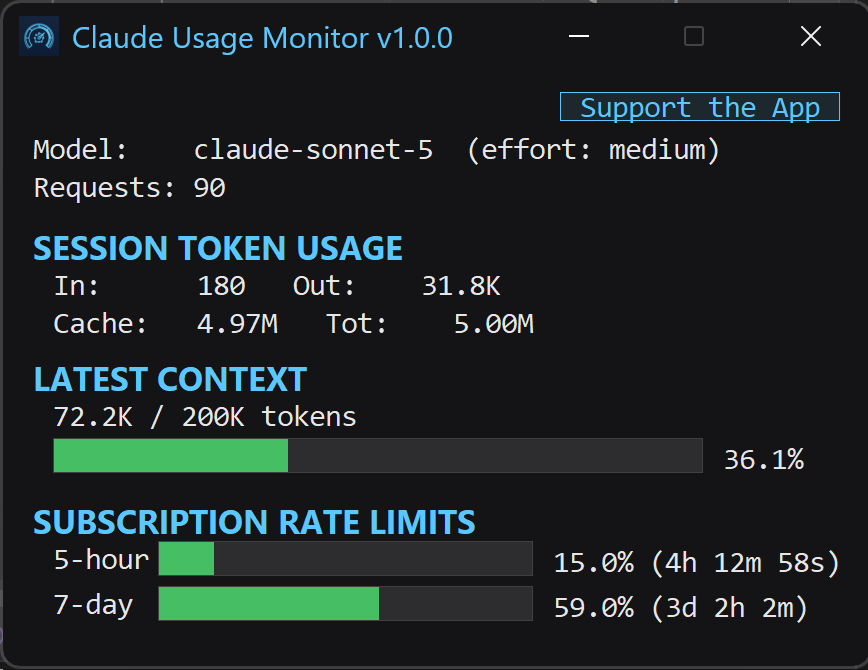

# Claude Usage Monitor

**Version 1.0.0**

A tiny, native Windows monitor that shows your Claude Code usage, session tokens, context window, and Anthropic account limits at a glance.

**[Download the latest release](../../releases/latest)**

It gives you the information you actually need while Claude Code is running:

* **5-hour usage** and reset countdown
* **7-day usage** and reset countdown
* Current Claude Code **session**
* **Input, output, cache creation, and cache read** tokens
* Current **context-window usage**
* Current **model** and **effort**
* Account-level usage limits from Anthropic
* Automatically installs a Claude Code `statusLine`
* Runs as a single native Windows executable

## Why another Claude usage monitor?

There are already plenty of Claude usage monitors.

This one is deliberately different.

It is a **small native Windows application written in C11 using Win32**.

There is:

* No Python
* No Node.js
* No Electron
* No runtime to install
* No third-party libraries
* No telemetry
* No cloud service

Just download the executable and run it.

## How it works

Claude Usage Monitor reads the local Claude Code session data stored on your computer and displays the current session information.

The monitor uses the credentials already maintained by Claude Code when querying Anthropic. It does not create, maintain, or store its own copy of those credentials.

Account-level usage and reset information is retrieved from Anthropic's usage service.

The application does not send your conversation contents anywhere. Local Claude Code JSONL files are read directly from your computer to extract session statistics; conversation contents are not collected or transmitted.

The source code is available for inspection.

## Installation

Download the [latest release](../../releases/latest) and run:

`ClaudeUsageMonitor.exe`

On first run, the application automatically configures a Claude Code `statusLine` if needed.

Before modifying your Claude Code settings, it creates a backup of the existing settings file.

No installer is required.

**Windows SmartScreen:** Because the executable is not digitally signed, Windows may display a SmartScreen warning when you first run it. This is a reputation warning, not an indication that the application requires an installer or additional software.

For security, download releases only from this GitHub repository.

## Requirements

* Windows 10 or later
* Claude Code

Claude Usage Monitor depends on Claude Code's local session and configuration formats, which may change between Claude Code releases.

## Troubleshooting

If the Claude Code `statusLine` does not appear after starting the monitor, restart Claude Code. The monitor only modifies the Claude Code configuration; restarting Claude Code causes the updated configuration to be loaded.

## What it shows

The monitor shows both your **account-level usage limits** and the **current Claude Code session**.

### Account usage

* 5-hour usage
* 5-hour reset time
* 7-day usage
* 7-day reset time

### Current session

* Model
* Effort level
* Input tokens
* Output tokens
* Cache creation tokens
* Cache read tokens
* Total context currently in use

The monitor can continue displaying account usage even when Claude Code is not actively running.

**Note:** Account usage and session token counts come from different data sources and should not be expected to correspond directly.

## Privacy

Claude Usage Monitor is designed to keep things local.

Claude Usage Monitor:
  * Does not collect telemetry
  * Does not require an account
  * Does not collect or transmit your conversation contents
  * Does not maintain or persist a copy of your Anthropic OAuth credentials
  * Reads Claude Code's local files directly
  * Uses Anthropic's usage endpoint for account-level quota information

The complete source code is included so you can see exactly what it does.

## Building from source

The project is written in C11 and targets native Win32.

It can be built with **Visual Studio 2022**.

No external libraries are required.

## Project status

This is a small utility built because I wanted a simple way to see what Claude Code was doing without running a large desktop application.

It intentionally doesn't try to be an all-in-one dashboard.

If you want **one small Windows executable that tells you what Claude Code is using right now**, this is what this project is for.

## Support

If you find it useful, you can support the project.

[Support Me](https://www.paypal.com/paypalme/MichaelHeilemann420)

## License

Claude Usage Monitor is released under the [MIT License](LICENSE).

The MIT License applies to the Claude Usage Monitor source code. It does not grant any rights to Claude Code, Anthropic APIs, Anthropic trademarks, or other third-party software or services.
